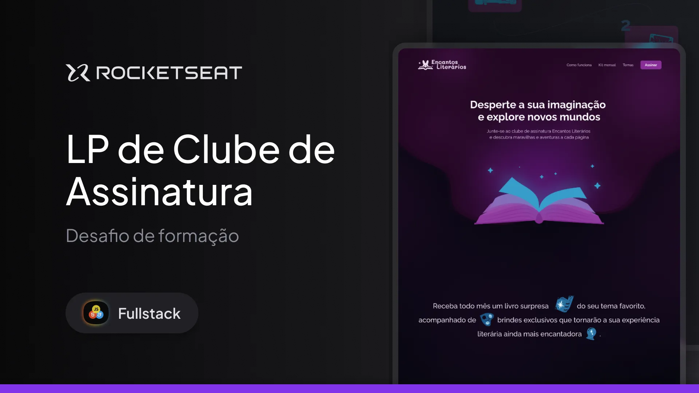

<h1 align="center">Encantos literários</h1>

Este projeto é um desafio do curso Fullstack da Rocketseat e trabalha o conceitos de animações em CSS como:

- CSS Animations;
- Responsividade;
- CSS Transitions;
- CSS Functions.

  <a href="#-tecnologias">Tecnologias</a>&nbsp;&nbsp;&nbsp;|&nbsp;&nbsp;&nbsp;
  <a href="#-projeto">Projeto</a>&nbsp;&nbsp;&nbsp;|&nbsp;&nbsp;&nbsp;
  <a href="#-layout">Layout</a>&nbsp;&nbsp;&nbsp;|&nbsp;&nbsp;&nbsp;
  <a href="#memo-licença">Licença</a>

  

 

  

## 🚀 Tecnologias

Este projeto foi desenvolvido com as seguintes tecnologias:

- HTML e CSS  
- Git e GitHub  
- Figma

## 💻 Projeto

O projeto apresenta a Landing page do serviço do app Encantos Literários.

- [Acesse o projeto finalizado online](https://dev-filipebcs.github.io/encantos-literarios/)

